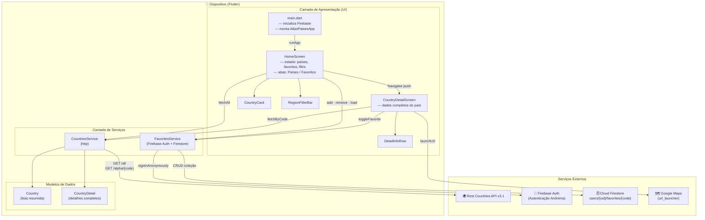

# Atlas de Países — Flutter

Aplicativo mobile construído com **Flutter** e integrado ao **Firebase**, para explorar países do mundo com dados da API Rest Countries.

## Funcionalidades

- Grade de países com bandeira, nome, código, região, capital e população.
- Filtro por região (África, Américas, Ásia, Europa, Oceania) com atualização instantânea.
- Tela de detalhes com informações completas: sub-região, área, idiomas, moedas, fusos horários, FIFA, lado do volante, início da semana, status ONU e link para Google Maps.
- **Favoritos** sincronizados com o Firebase Firestore — persiste entre sessões via autenticação anônima.
- Badge de contagem de favoritos na barra de navegação.
- Estado de erro com botão de nova tentativa.
- Tela amigável de orientação caso o Firebase não esteja configurado.

## Tecnologias utilizadas

| Tecnologia | Versão | Uso |
|---|---|---|
| Flutter | ^3.x | Framework principal |
| Dart | ^3.x | Linguagem |
| Firebase Core | ^3.9.0 | Inicialização do Firebase |
| Cloud Firestore | ^5.6.0 | Persistência dos favoritos |
| Firebase Auth | ^5.3.4 | Autenticação anônima do usuário |
| http | ^1.3.0 | Requisições à Rest Countries API |
| url_launcher | ^6.3.0 | Abertura do Google Maps |
| Rest Countries API | v3.1 | Fonte de dados dos países |

## Pré-requisitos

- [Flutter SDK](https://docs.flutter.dev/get-started/install) 3.x ou superior
- [Dart SDK](https://dart.dev/get-dart) 3.x ou superior (já incluso no Flutter)
- [Node.js](https://nodejs.org/) (para o Firebase CLI)
- Conta no [Firebase Console](https://console.firebase.google.com/)
- Android Studio / Xcode (para emuladores) ou dispositivo físico

Verifique sua instalação:

```bash
flutter doctor
```

## Configuração do Firebase

Este projeto requer um projeto Firebase próprio. Siga os passos abaixo:

### 1. Instale o Firebase CLI e o FlutterFire CLI

```bash
npm install -g firebase-tools
dart pub global activate flutterfire_cli
```

### 2. Faça login no Firebase

```bash
firebase login
```

### 3. Crie um projeto no Firebase Console

Acesse [console.firebase.google.com](https://console.firebase.google.com/), clique em **Adicionar projeto** e siga o assistente.

### 4. Ative os serviços necessários

No Firebase Console, dentro do seu projeto:

- **Authentication** → aba **Sign-in method** → habilite **Anônimo**
- **Firestore Database** → clique em **Criar banco de dados** → escolha o modo de produção ou teste

#### Regras sugeridas para o Firestore (modo de desenvolvimento)

```
rules_version = '2';
service cloud.firestore {
  match /databases/{database}/documents {
    match /users/{userId}/favorites/{document=**} {
      allow read, write: if request.auth != null && request.auth.uid == userId;
    }
  }
}
```

### 5. Gere o arquivo de configuração do Flutter

Na raiz do projeto, execute:

```bash
flutterfire configure
```

Selecione o projeto Firebase criado e as plataformas desejadas (Android, iOS). Isso gera automaticamente o arquivo `lib/firebase_options.dart`.

## Como executar o projeto

### 1. Clone o repositório

```bash
git clone <url-do-repositorio>
cd trabalho_marcio_mobile
```

### 2. Instale as dependências Flutter

```bash
flutter pub get
```

### 3. Configure o Firebase

Siga a seção **Configuração do Firebase** acima e execute `flutterfire configure`.

### 4. Execute o app

```bash
# Em dispositivo/emulador Android ou iOS
flutter run

# Para escolher o dispositivo manualmente
flutter run -d <device-id>

# Listar dispositivos disponíveis
flutter devices
```

## Scripts disponíveis

| Comando | Descrição |
|---|---|
| `flutter run` | Executa em modo debug |
| `flutter run --release` | Executa em modo release |
| `flutter build apk` | Gera APK Android |
| `flutter build appbundle` | Gera AAB para Google Play |
| `flutter build ios` | Gera build iOS (requer macOS) |
| `flutter test` | Executa os testes |
| `flutter analyze` | Análise estática do código |
| `flutter pub get` | Instala dependências |
| `flutter pub upgrade` | Atualiza dependências |

## Estrutura do projeto

```
lib/
├── main.dart                        # Entrada do app, inicialização Firebase e tema
├── firebase_options.dart            # Gerado pelo FlutterFire CLI (não versionar)
│
├── models/
│   ├── country.dart                 # Modelo de país (lista)
│   └── country_detail.dart         # Modelo de país (detalhes completos)
│
├── services/
│   ├── countries_service.dart       # Fetch da Rest Countries API (http)
│   └── favorites_service.dart      # CRUD de favoritos no Firestore
│
├── screens/
│   ├── home_screen.dart             # Tela principal (grade + favoritos)
│   └── country_detail_screen.dart  # Tela de detalhes do país
│
└── widgets/
    ├── country_card.dart            # Card reutilizável de país
    ├── region_filter_bar.dart       # Chips de filtro por região
    └── detail_info_row.dart         # Linha chave-valor nos detalhes
```

## Fluxo de navegação

```
HomeScreen
├── Aba "Países"
│   ├── RegionFilterBar  (filtro por região)
│   └── Grid de CountryCard
│       └── tap → CountryDetailScreen
│           └── botão "Ver no Google Maps" → abre app externo
└── Aba "Favoritos"
    └── Grid de CountryCard (apenas favoritados)
        └── tap → CountryDetailScreen
```

## Arquitetura da aplicação

O app segue uma arquitetura em três camadas dentro do Flutter, integrada a serviços externos via Firebase e HTTP.



### Resumo das responsabilidades

| Camada | Arquivos | Responsabilidade |
|---|---|---|
| **Apresentação** | `screens/`, `widgets/`, `main.dart` | Renderizar UI, gerenciar estado local, navegar entre telas |
| **Serviços** | `services/countries_service.dart` | Buscar lista e detalhes de países via HTTP |
| **Serviços** | `services/favorites_service.dart` | Autenticação anônima e persistência de favoritos no Firestore |
| **Modelos** | `models/country.dart`, `models/country_detail.dart` | Deserializar e tipificar os dados das APIs |
| **Externo** | Rest Countries API | Fonte de dados dos países (flags, nome, região, etc.) |
| **Externo** | Firebase Auth | Identidade anônima por instalação (UID único sem cadastro) |
| **Externo** | Cloud Firestore | Armazenamento persistente de favoritos por usuário |
| **Externo** | Google Maps | Visualização do país no mapa via deep link |

### Fluxo de dados principal

```
Inicialização
  └─ main.dart inicializa Firebase
       └─ HomeScreen carrega em paralelo:
            ├─ CountriesService.fetchAll()  →  Rest Countries API  →  List<Country>
            └─ FavoritesService.loadFavoriteCodes()  →  Firestore  →  Set<String>

Favoritar um país (atualização otimista)
  └─ UI atualiza estado imediatamente
       └─ FavoritesService.addFavorite() ou removeFavorite()  →  Firestore
            └─ [erro] reverte estado + exibe SnackBar

Abrir detalhes
  └─ Navigator.push(CountryDetailScreen)
       └─ CountriesService.fetchByCode()  →  Rest Countries API  →  CountryDetail
            └─ botão "Ver no Google Maps"  →  url_launcher  →  Google Maps
```

## Integração com Firebase

### Autenticação Anônima

O app realiza login anônimo automático na primeira abertura via `FavoritesService.ensureSignedIn()`. Isso garante que cada instalação tenha um UID único sem exigir cadastro do usuário.

### Cloud Firestore — Estrutura de dados

```
users/
  {uid}/
    favorites/
      {countryCode}/          ← ex: "BR", "US", "JP"
        common: "Brazil"
        official: "Federative Republic of Brazil"
        flagUrl: "https://..."
        region: "Americas"
        capital: "Brasília"
        population: 214326223
        code: "BR"
```

### Fluxo de favoritos

1. Usuário toca no ícone de coração em um card ou na tela de detalhes.
2. A UI é atualizada imediatamente (otimista).
3. A operação é sincronizada em background com o Firestore.
4. Em caso de erro, a UI reverte ao estado anterior e exibe um SnackBar.

## Fonte de dados

Este projeto utiliza a API pública [Rest Countries](https://restcountries.com/):

- Lista simplificada:
  `https://restcountries.com/v3.1/all?fields=name,flags,region,capital,population,cca2`
- Detalhes por código:
  `https://restcountries.com/v3.1/alpha/{code}`

## Troubleshooting

**Firebase não configurado (tela de aviso ao iniciar)**
Execute `flutterfire configure` na raiz do projeto. Consulte a seção **Configuração do Firebase**.

**`firebase_options.dart` não encontrado**
O arquivo é gerado pelo FlutterFire CLI e não é versionado. Execute:
```bash
flutterfire configure
```

**Erro de compilação Android: `INTERNET permission`**
Já adicionado em `android/app/src/main/AndroidManifest.xml`. Se persistir, execute:
```bash
flutter clean && flutter pub get
```

**`flutter doctor` mostra problemas**
Corrija os itens listados pelo `flutter doctor` antes de tentar rodar o projeto.

**Imagens de bandeiras não carregam**
Verifique a conexão com a internet. A Rest Countries API e as imagens são externas.

**Erro ao abrir Google Maps**
Certifique-se de que o app do Google Maps está instalado no dispositivo. Em emuladores, pode ser necessário instalar manualmente.

## Boas práticas para contribuição

- Mantenha os `services` desacoplados da UI — telas não devem importar `http` diretamente.
- Use `mounted` antes de chamar `setState` após operações assíncronas.
- Não faça commit de `lib/firebase_options.dart` com chaves de produção em repositórios públicos.
- Execute `flutter analyze` antes de abrir um PR.

## Próximos passos sugeridos

- Adicionar busca por nome de país.
- Implementar modo offline com cache local (ex: `shared_preferences` ou `sqflite`).
- Adicionar testes de widget e integração.
- Suporte a tema escuro.
- Migrar state management para `riverpod` ou `bloc` conforme o projeto crescer.
